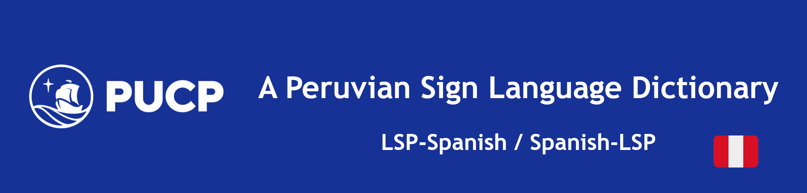
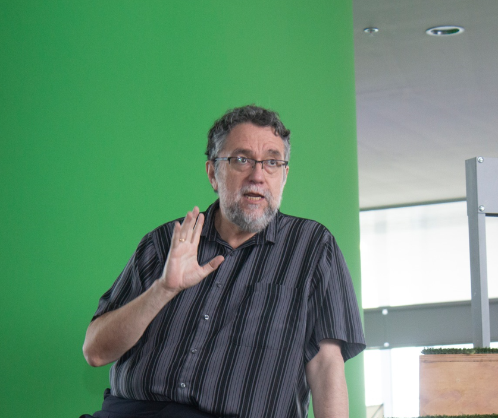

<!-- 

 -->

[📚Documentation](https://diccionario-lsp.github.io/Docs/README.html) |
[✌️Dictionary LSP](https://www.dvlsp.link)
[🗃️Peruvian Database](https://drive.google.com/drive/folders/1-DZjxfWbwWhDerW2M5lRFjjR5KC7TWTX?usp=sharing)

# Welcome!👋

## Why LSP is important?

Peruvian Sign Language (LSP from Spanish) plays a vital role in promoting inclusive development for Deaf individuals. LSP provides a means of communication and expression, enabling signers to interact with their communities, access education, and participate fully in various aspects of life. By bridging the communication gap between the Deaf community and the hearing world, LSP contributes to a more inclusive and equitable society.

## Description of the Database

The PUCP305 Database is part of a larger collection of LSP databases with signs, sentences, narrations and dialogues, put together by the Research Group Señas Gramaticales from the Pontifical Catholic University of Peru (PUCP). The various databases feature different sets of data elicitated in controlled environments, recorded from dozens of Deaf LSP signers; it serves as a valuable resource for documenting LSP. The goal is to promote the dissemination and preservation of Peruvian Sign Language, encouraging its teaching and fostering cross-cultural understanding.

In particular, the PUCP305 Database encompasses a wide array of terms, each accompanied by videos, Spanish translations, sign language transcriptions, and example sentences. From this, 511 glosses and 374 unique classes or lemmas were selected. These terms have been recorded from a total of 275 sentence videos. Each video and its corresponding transcription contribute to a deeper understanding of signs and their usage context. 

## Contributors

### Linguistics and the Deaf Community

The development of the Dictionary LSP and the PUCP305 Database is a collaborative effort between linguistics experts and the Deaf community. Linguistics experts, such as Miguel Rodríguez Mondoñedo, César Ramos and Francisco Cerna, Sabina Oporto, and Alexandra Arnaiz, contribute their knowledge and expertise to ensure accurate translations and sign language transcriptions. A group of LSP signers (Ana Rosa Moreno Sinchi y Juan Villamonte) and CODA annotators (Jocelyn Zúñiga y Abraham Ramírez) lead by Juan Villamonte, provided invaluable insights into the language and culture of LSP. This collaboration ensures that the Dictionary LSP is comprehensive and reflective of the needs and experiences of the deaf community. 

  

    
    <h3>Miguel Rodríguez Mondoñedo</h3>
    
Líder de Lingüística

  

  

    
    <h3>Juan Villamonte</h3>
    
Consultor LSP

  

  

    
    <h3>Alexandra Arnaiz</h3>
    
Intérprete de Lengua de Señas Peruana

  

  

    
    <h3>Sabina Oporto</h3>
    
Gestora de Anotaciones LSP y Voluntarios

  

  

    
    <h3>Francisco Cerna</h3>
    
Apoyo de Anotación y protocolo de pruebas

  

  

    
    <h3>César Ramos</h3>
    
Apoyo de Anotación

  

### Code Contributors

The development of the LSP Service involves the contributions of dedicated software developers and engineers. These code contributors, including Gissella Bejarano, Joe Huamani, and Carlos Vásquez, worked tirelessly to develop and maintain the infrastructure, algorithms, and systems that power the service. Their expertise in software development and machine learning enables the accurate and efficient translation of Spanish text and video into LSP and viceversa. Furthermore, this accomplishment couldn't be done without the help of volunteer members who supports the development of the LSP Web in their different stages.

  

    
    <h3>Gissella Bejarano</h3>
    
Líder de Inteligencia Artificial

  

  

    
    <h3>Joe Huamaní Malca</h3>
    
Ingeniero de Aprendizaje de Máquina / Machine Learning Engineer

  

  

    
    <h3>Carlos Vasquez</h3>
    
Ingeniero de Datos / Data Engineer

  

  

    
    <h3>Julio Mendoza</h3>
    
Ingeniero de la Nube / Cloud Engineer

  

  

    
    <h3>Jenny Vega</h3>
    
Asesora en AWS

  

  

    
    <h3>Daniel Carbajal</h3>
    
Asesor en AWS y de Desarrollo de Software

  

  

    
    <h3>Corrado Daly</h3>
    
Soporte de la Nube

  

  

    
    <h3>Rossy Latorraca</h3>
    
Soporte de Interfaz Web

  

<!-- ## News

Stay up to date with the latest news and updates from the team behind the Spanish To LSP Translation Service. We regularly share announcements, improvements, and new features to enhance your experience and promote the accessibility of LSP. Check back often for exciting updates and developments in our ongoing mission to facilitate inclusive communication and understanding.

- June 2023: LSP has ...
- March 2023: LSP Team won ... -->

