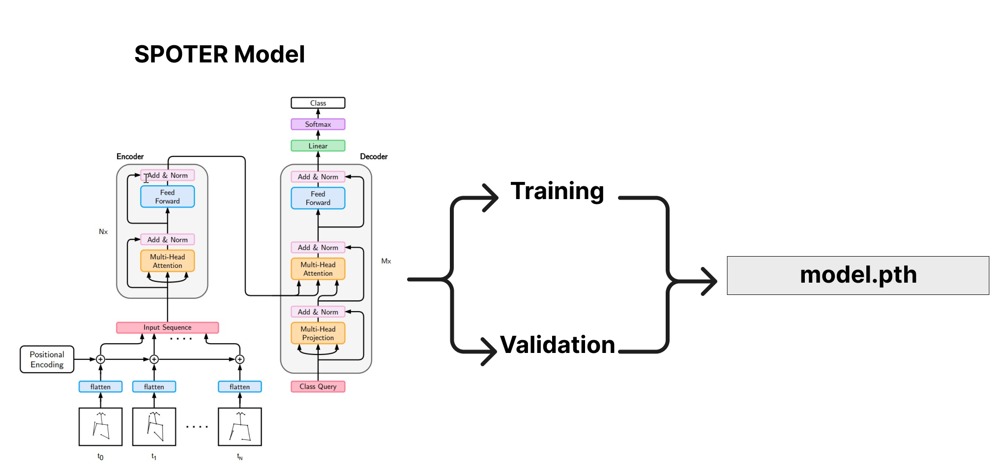

# Sign Language Recognition Model Overview

For the SLR model training stage, a pre-existing model developed by Matyáš Boháček and Marek Hrúz from the <a href="https://github.com/matyasbohacek/spoter" target="_blank">`SPOTER`</a> repository was used as a starting point. However, several modifications were made to adapt the model to the specific dataset being worked on.

The following files were modified:

1. <a href="https://github.com/JoeNatan30/spoter/blob/main/datasets/Lsp_dataset.py" target="_blank">`Lsp_dataset.py`</a>: The keypoints were adapted to the output provided by Mediapipe. This adaptation was done from the data loading in Connecting Points to the data output. Although it is uncertain whether the same keypoints as SPOTER were used, the data augmentation structure remains the same as in SPOTER, but it was adjusted to work with the appropriate keypoints from Mediapipe.

2. <a href="https://github.com/JoeNatan30/spoter/blob/main/normalization/body_normalization.py" target="_blank">`body_normalization.py`</a> and <a href="https://github.com/JoeNatan30/spoter/blob/main/normalization/hand_normalization.py" target="_blank">`hand_normalization.py`</a>: The structure of these files remains similar to SPOTER, but the keypoints were adjusted to work with Mediapipe. The normalization was changed from using the neck distance to using the shoulder distance, which may require further review. However, it should be noted that there are studies showing that normalizing by either neck distance or shoulder distance is acceptable.

3. <a href="https://github.com/JoeNatan30/spoter/blob/main/utils.py" target="_blank">`utils.py`</a>: Adapted to work with WandB and adjusted to meet the specific reporting needs of the project.

4. <a href="https://github.com/JoeNatan30/spoter/blob/main/spoter/spoter_model.py" target="_blank">`spoter_model.py`</a>: The SPOTER model has undergone several changes, but in the latest version, it was made to closely resemble the original. The only variations made were related to the hyperparameters.

5. <a href="https://github.com/JoeNatan30/spoter/blob/main/train.py" target="_blank">`train.py`</a>: This file has undergone significant changes and essentially represents a custom implementation, building on the work of SPOTER as a foundation.

Finally, model.pth is saved to be used in the inference as part of the deployment step

  

It is important to note that while the SLR model is based on the SPOTER repository, the modifications and adaptations mentioned above were essential to ensure its suitability for the specific sign language dataset being used in the project.
